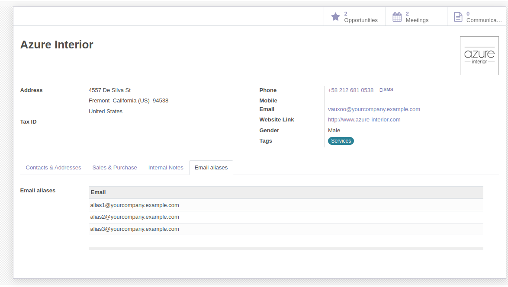

To use this module, you need to:

#. Go to a contact, under the **Email aliases** tab, and enter any desired email addresses.
   *You won't be able to add an address that is already used as a main address, or in another email alias.*

